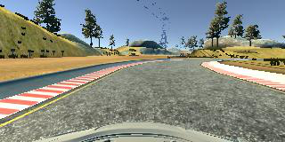

# Behavioral-Cloning P3
## Description
In this project, collecting data of driving in a simulator then feeding the data (camera view and steering) into a neural network to clone behaivor of the driver. Camera view includes center, left, and right images with only one steering data then steering is adjusted depending on the which left or right view. 

To avoid overfitting and removing unrelated information, images goes through preprocessing stages.

As a convulution network model, the model described in [NVDIA](https://devblogs.nvidia.com/parallelforall/deep-learning-self-driving-cars/) paper is used. 

## Files Submitted & Code Quality
### 1. **Submission includes all required files and can be used to run the simulator in autonomous mode**: 
Two new files are generated model.py and helper.py. In model.py file model architecture is defined and trainig is also done in model.py. Images need to be augmented to avoid overfitting. 

* model.py generates model-000.h5 file if the model' accuracy is better than previous one 
* helper.py is used for image processing and feeding the data into model.fit_generator() 
* README.md for details of the project 1c
* driver.py file is used to validate the model 1d

### 2. **Submission includes functional code Using the Udacity provided simulator and my drive.py file, the car can be driven autonomously around the track by executing**:

* python drive.py model-000.5 laketrack (laketrack.mp4 video created)
* [laketrack.mp4](youtube.com)

### 3. **Submission code is usable and readable**:

* Two python codes are submitted: helper.py and model.py
* helper.py has two classes: image_processing and generator, inherits from image_processing class
* model.py contains two classes: build_model(), inherits from generator class, and train_model(), inherits from build_model
* model.py has main() funtion includes parser command line options 

## Model Architecture and Training Strategy:
### 1. **An appropriate model architecture has been employed**:

* The model table shown below is based on [NVDIA](https://devblogs.nvidia.com/parallelforall/deep-learning-self-driving-cars/) and some modification made to the model -- images contain irrelevant information such as sky and trees also to avoid overfitting 50% of data is dropped. 

  | Layer(type)          | Output Shape    | Param#  |
  | ---------------------|:---------------:| -------:|
  | Lambda               | None,75,320,3   |    0    |
  | Cropping(Cropping2D) | None,90,320,3   |    0    |
  | Conv2d_1(Conv2D)     | None,36,158,24  |   1824  |
  | Conv2d_2(Conv2D)     | None,16,77,36   |  21636  |
  | Conv2d_3(Conv2D)     | None,6,37,48    |  43248  |
  | Conv2d_4(Conv2D)     | None,4,35,64    |  27712  |
  | Conv2d_5(Conv2D)     | None,2,33,64    |  36928  |
  | Dropout_1(Dropout)   | None,2,33,64    |    0    |
  | Flatten_1(Flatten)   | None,4224       |    0    |
  | Dense_1(Dense)       | None,100        |  844900 |
  | Dense_2(Dense)       | None,50         |   5050  |
  | Dense_3(Dense)       | None,10         |    510  |
  | Dense_4(Dense)       | None,1          |    11   |

### 2. **Attempts to reduce overfitting in the model**:

* Right after convolutional layer 5 ends and before connected to fully neural network (Flatten_1), 50% of data is dropped for reducing overfitting. 

## 3. **Model parameter tuning**:

  Time to traing the model and loss value are the two parameters took into consideration while tuning the model's parameters. 
  
* Learning Rate for Adam Optimizer = 1e-5 (tuned between 1e-3 and 1e-5)
* Epoch = 20 (tuned between 5 and 20) and 20 has the lower loss
* Steps per epoch = 2000 (exprimented with range from 100 to 2000)
* Batch Size = 40 (tuned by ranging from 30 to 128)

## 4. **Appropriate training data**:

* To collect the data in simulator, I drove the car twice clockwise and counter clockwise and stayed in the middle of the road also to gather data in case of getting of the track I drove at the edge then steered to the middle of the road.

## Image Processing:

* There are three camera views: center, right, and left view. Since some of the information is irrelevant images cropped from top and bottom. 

## References: 
1. NVDIA Model: https://devblogs.nvidia.com/parallelforall/deep-learning-self-driving

